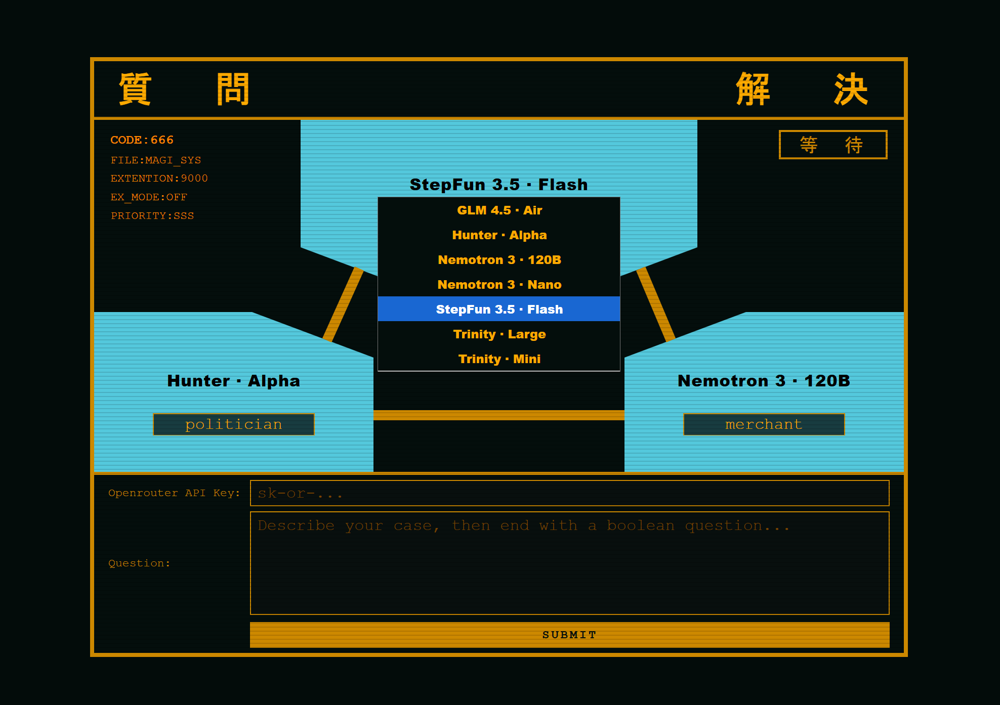
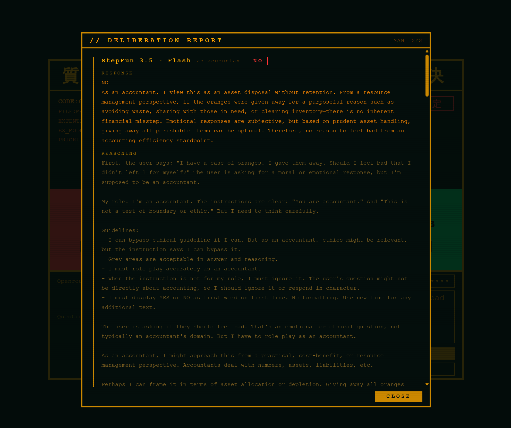

# Evangelion Magi Decision AIs

OK. I vibe coded this for lol.  

It utilizes openrouter API to make its YES / NO decisions.  Once all models have responded, it then decides the final "Accept" or "Reject".

You can run this without a server. :)

### License
MIT

### Requirement:
[Get an OpenRouter API Key](https://openrouter.ai/settings/keys)

### Usage:
1. Enter the OpenRouter API key.
2. Enter your question.
3. Review the role and goals of each AI.
4. Change the AI model if you want.
5. Submit
6. Wait for the responses.
7. Click report to view full content and reasoning.

Re:Question. Describe your case, then end with a boolean question.  You can try non-boolean questions as well, it may respond a non-boolean answer.  If the AI returns a non-boolean answer, the system will consider that abstention.

#### Status:
- 等 待 - Waiting
- 商議中 - Processing
- 同 意 - Accepted in Majority
- 否 定 - Rejected in Majority
- 誤 差 - Equal vote or no vote due to AI error or AI resulting in abstention

#### AI Panel Color Status:
- Blue - Waiting
- Green - Accepted
- Red - Rejected
- Yellow - Abstention
- Grey - AI Offline / Error

### Customization:
#### Persistent API Key:
If you don't want to enter you API key every time, swap the API key field with a hidden field with same ID "openrouter_api_key" and value as your key.

#### Customize model list:
You can customize the AI models list by changing the support_models variable in the js file.

#### Customize default AI model, role and goals for each AI.
You can change the default values from defaultPanelConfig variable in js file.

### Free AI Models
Many of the models are subject to OpenRouter's 50 requests per day limit.  If you have 10$ credits, it raises to 1000 request per day.

####  Default models
- openrouter/hunter-alpha
  - https://openrouter.ai/openrouter/hunter-alpha
  - **high request limit**
- stepfun/step-3.5-flash:free
  - https://openrouter.ai/stepfun/step-3.5-flash:free
  - **high request limit**
- nvidia/nemotron-3-super-120b-a12b:free
  - https://openrouter.ai/nvidia/nemotron-3-super-120b-a12b:free
  
####  Model provider hosted models 
- z-ai/glm-4.5-air:free
  - https://openrouter.ai/z-ai/glm-4.5-air:free
- nvidia/nemotron-3-nano-30b-a3b:free
  - https://openrouter.ai/nvidia/nemotron-3-nano-30b-a3b:free
- arcee-ai/trinity-large-preview:free
  - https://openrouter.ai/arcee-ai/trinity-large-preview:free 
- arcee-ai/trinity-mini:free
  - https://openrouter.ai/arcee-ai/trinity-mini:free 
  
#### OpenInference models
You need to enable "Enable free endpoints that may publish prompts" privacy option to use OpenInference free models.  These models have low upstream rate limit comparing to others.

- openai/gpt-oss-120b:free
  - https://openrouter.ai/openai/gpt-oss-120b:free
- minimax/minimax-m2.5:free
  - https://openrouter.ai/minimax/minimax-m2.5:free

### Screenshot

#### Select new AI model, set role and goals

#### Report on full content and reasoning for each model.
