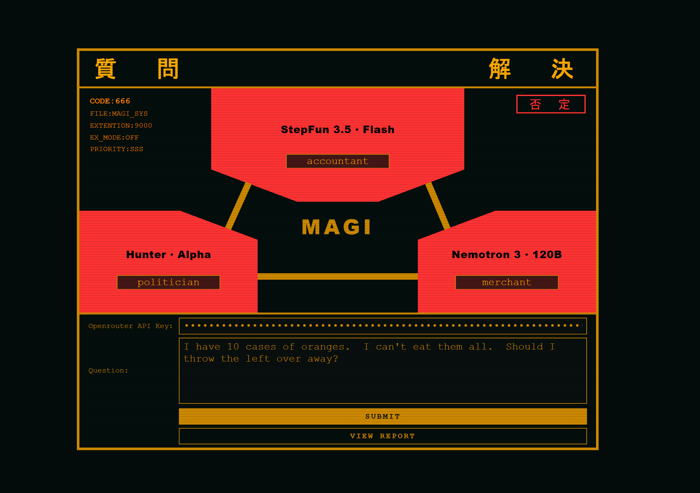

# Evangelion Magi Decision AIs

OK. I vibe code this for lol.  

It utilizes openrouter API to make its YES / NO decisions.  Once all models have responded, it then decides the final "Accept" or "Reject".

### License
MIT

### Free AI Models
- nvidia/nemotron-3-super-120b-a12b:free
- stepfun/step-3.5-flash:free
- openrouter/hunter-alpha (free)

### Requirement:
[Get an OpenRouter API Key](https://openrouter.ai/settings/keys)

### Usage:
1. Enter the API key
2. Set the role of each AI
3. Enter your question
4. Submit
5. Wait for the responses.

### Advance Usage:
Model reasoning is logged in dev console.

### Screenshot
